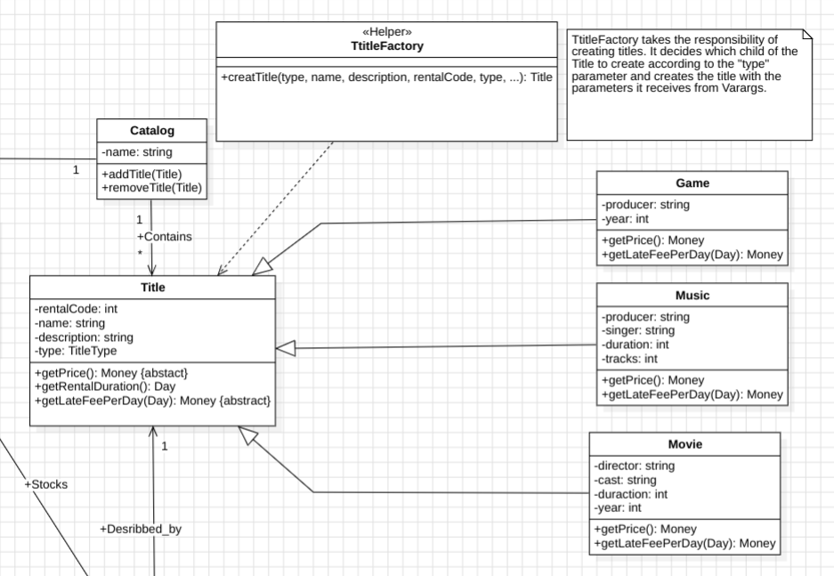
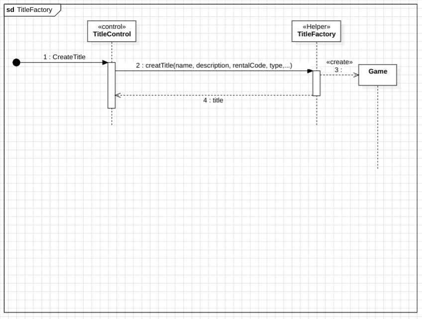
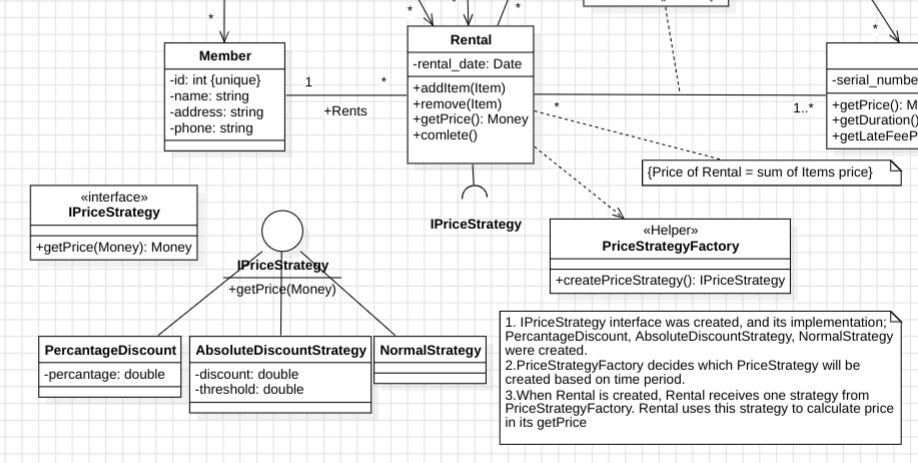
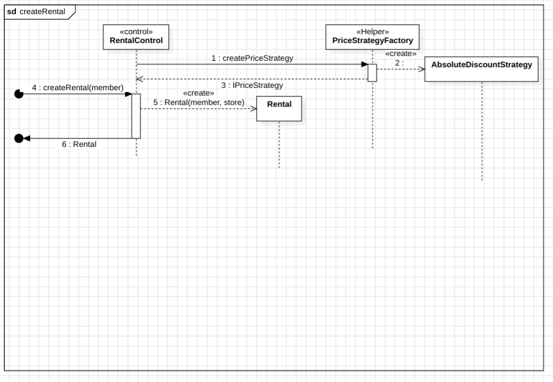

# Assignment 4
## Create Title

TtitleFactory takes the responsibility of creating titles. It decides which child of the Title to create according to the "type" parameter and creates the title with the parameters it receives from [Varargs](https://docs.oracle.com/javase/8/docs/technotes/guides/language/varargs.html).

## Pluggable Pricing Rules

1. IPriceStrategy interface was created, and its implementation; PercantageDiscount, AbsoluteDiscountStrategy, NormalStrategy were created.
2. PriceStrategyFactory decides which PriceStrategy will be created based on time period.
3. When Rental is created, Rental receives one strategy from PriceStrategyFactory. Rental uses this strategy to calculate price in its getPrice

# Assignment 2 & 3
# UML

# Sequence Diagrams

## Quick Links
1. [UML](#uml)
1. [Sequence Diagrams](#sequence-diagrams)
    1. [CreateRental](#createrental) 
    1. [AddItem](#additem)
    1. [GetItemInformation](#getiteminformation)
    1. [GetTotalPrice](#gettotalprice)
    1. [Complete](#complete)
### CreateRental
back to [Quick Links](#quick-links)

### AddItem
back to [Quick Links](#quick-links)

### GetItemInformation
back to [Quick Links](#quick-links)

### GetTotalPrice
back to [Quick Links](#quick-links)

### Complete
back to [Quick Links](#quick-links)

# Contributors
1. Taylan Taşkın
2. Ahmet Tarık Duyar
3. 

   
