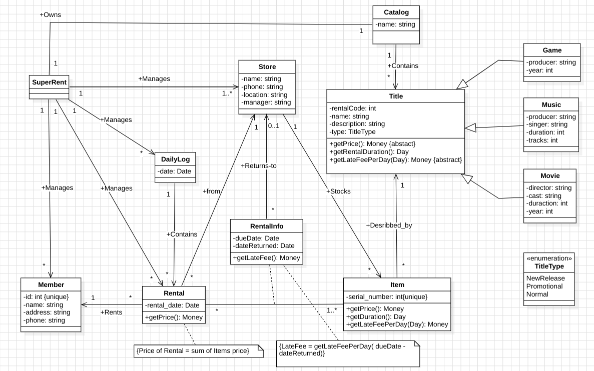
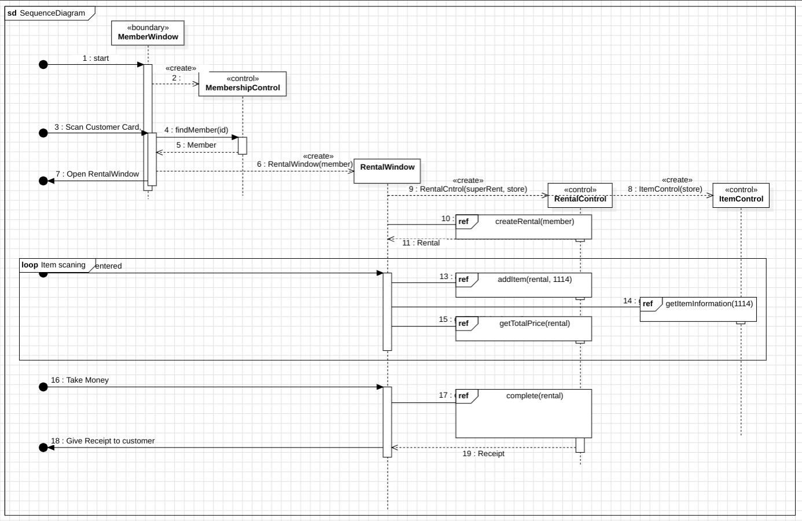
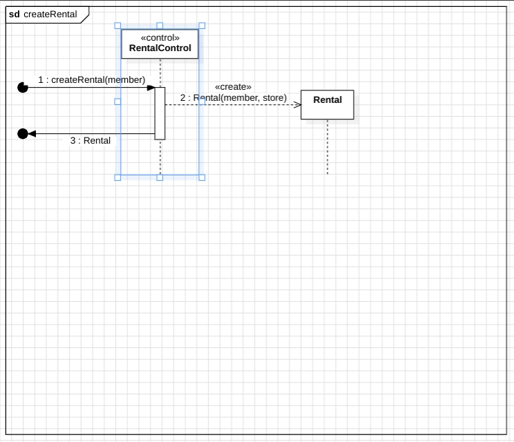
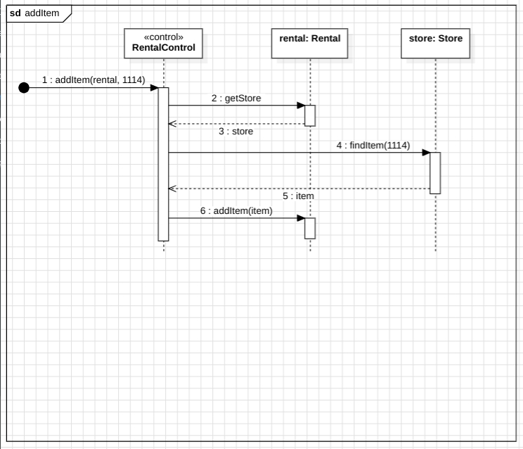
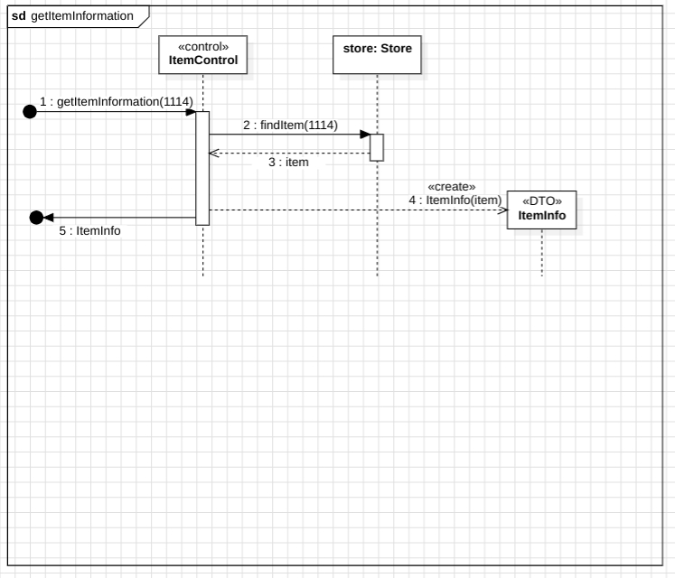
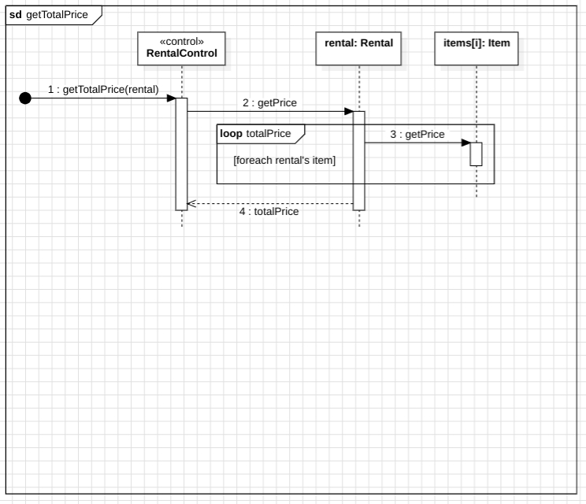
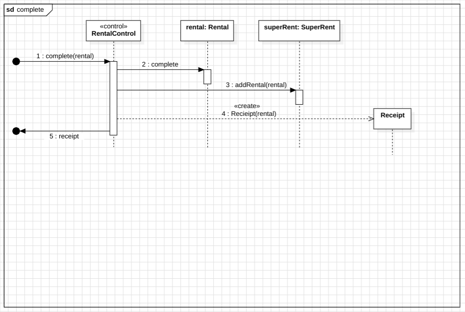

# UML

# Sequence Diagrams

## Quick Links
1. [UML](#uml)
1. [Sequence Diagrams](#sequence-diagrams)
    1. [CreateRental](#createrental) 
    1. [AddItem](#additem)
    1. [GetItemInformation](#getiteminformation)
    1. [GetTotalPrice](#gettotalprice)
    1. [Complete](#complete)
### CreateRental
back to [Quick Links](#quick-links)

### AddItem
back to [Quick Links](#quick-links)

### GetItemInformation
back to [Quick Links](#quick-links)

### GetTotalPrice
back to [Quick Links](#quick-links)

### Complete
back to [Quick Links](#quick-links)

